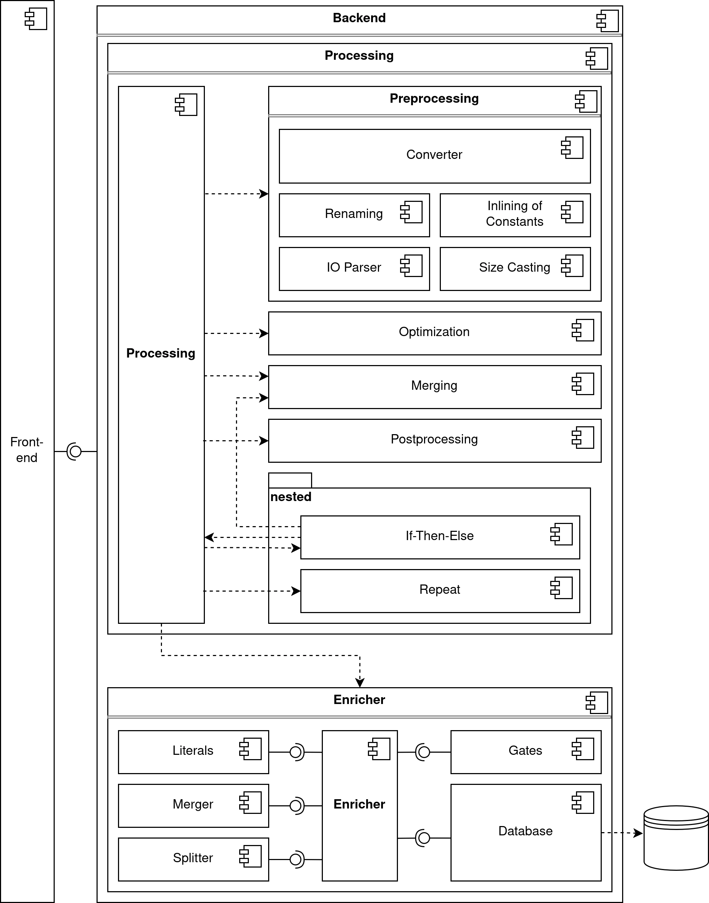
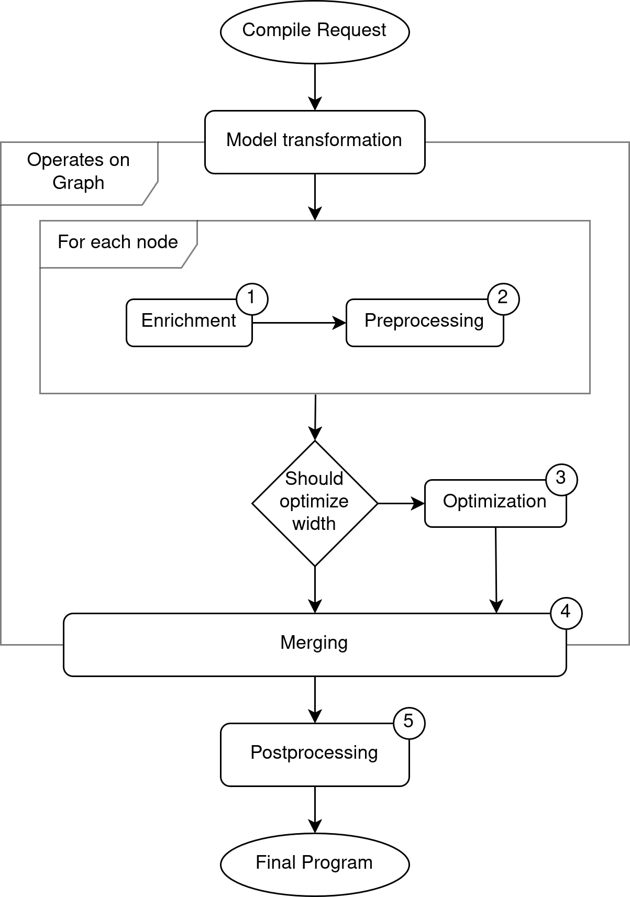

Architecture
============

Component Overview
------------------

The following diagram shows the architecture of the backend:

The backend is composed of the following main components:

- **Processing** (:py:mod:`app.processing`):
  Coordinates the end-to-end handling of :class:`~app.model.CompileRequest.CompileRequest`, including compilation and enrichment.

- **Enricher** (:py:mod:`app.enricher`):
  Retrieves implementations and is extendable via strategies that implement :class:`~app.enricher.EnricherStrategy`

- **Preprocessing** (:py:mod:`app.processing.pre`):
  Contains logic for individual node transformations that do not require global graph context, such as:

  - **Converter** (:py:mod:`app.processing.pre.converter`):
    Converts OpenQASM 2 to OpenQASM 3.

  - **Renaming** (:py:mod:`app.processing.pre.renaming`):
    Ensures unique and conflict-free identifiers.

  - **Inlining** (:py:mod:`app.processing.pre.inlining`):
    Replaces aliases with their resolved content.

  - **IO Parser** (:py:mod:`app.processing.pre.io_parser`):
    Parses input/output annotations.

  - **Size Casting** (:py:mod:`app.processing.pre.size_casting`):
    Aligns input register sizes.

- **Optimization** (:py:mod:`app.processing.optimize`):
  Attempts to reduce circuit width via ancilla reuse heuristics.

- **Merging** (:py:mod:`app.processing.merge`):
  Applies the graph connections and flattens the node structure into a single, linear OpenQASM program.

- **Postprocessing** (:py:mod:`app.processing.post`):
  Performs cleanup steps such as removing duplicate imports and rendering the final program into OpenQASM 3.1.

- **Nested Structures** (:py:mod:`app.processing.nested`):

  - **Repeat** (:py:mod:`app.processing.nested.repeat`):
    Unrolls the repeat node to be processed by the pipeline.

  - **If-Then-Else** (:py:mod:`app.processing.nested.if_then_else`):
    Merges two subgraphs into one big if-then-else statement by using parts of processing

Pipeline Flow
-------------

The following diagram illustrates the pipeline stages for processing a :class:`~app.model.CompileRequest.CompileRequest`:

Upon receiving a CompileRequest, the backend transforms the input model into an internal graph and processes it through a five-stage pipeline:
node enrichment, syntactic and semantic preprocessing, optional ancilla-optimized circuit optimization, output-input merging, and final AST normalization.
The result is a complete, semantically valid OpenQASM 3 program.

.. TODO add correct URL: For detailed information, refer to the `official LEQO-backend publication <https://www.iaas.uni-stuttgart.de/forschung/veroeffentlichungen/...>`_
